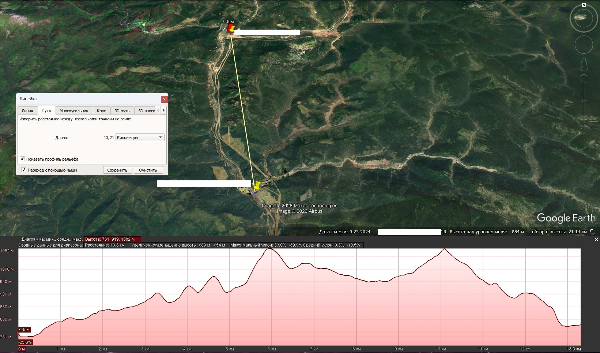
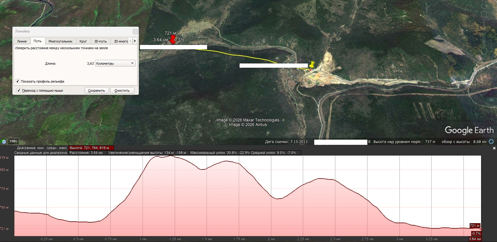
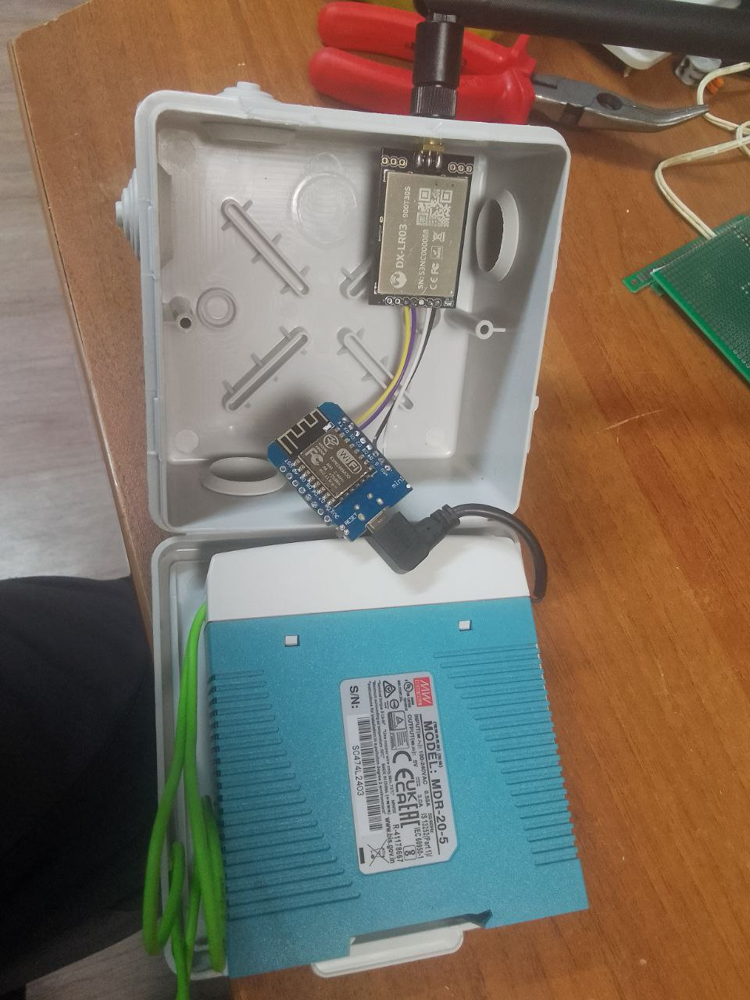
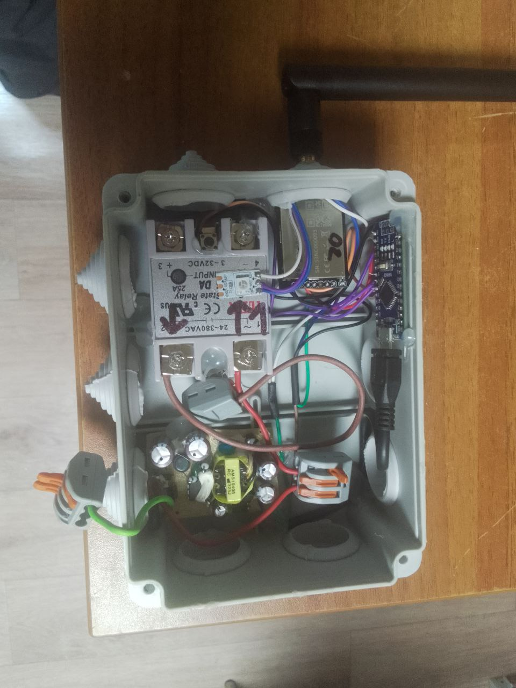

# LoRa Мульти-контроллер

**Система беспроводного управления реле через веб-интерфейс и настольное приложение**






---

# 📋 Содержание

1. [Описание проекта](#описание-проекта)
2. [Архитектура системы](#архитектура-системы)
3. [Компоненты системы](#компоненты-системы)
   - [Передатчик (TX)](#передатчик-tx)
   - [Приёмник (RX)](#приёмник-rx)
   - [Настольное приложение](#настольное-приложение)
4. [Требования](#требования)
5. [Сборка и прошивка](#сборка-и-прошивка)
   - [Прошивка передатчика](#прошивка-передатчика)
   - [Прошивка приёмника](#прошивка-приёмника)
6. [Настройка и эксплуатация](#настройка-и-эксплуатация)
   - [Первый запуск передатчика](#первый-запуск-передатчика)
   - [Подключение к веб-интерфейсу](#подключение-к-веб-интерфейсу)
   - [Настройка WiFi](#настройка-wifi)
   - [Добавление приёмников](#добавление-приёмников)
7. [Полное руководство по настольному приложению](#полное-руководство-по-настольному-приложению)
   - [Первый запуск приложения](#первый-запуск-приложения)
   - [Интерфейс приложения](#интерфейс-приложения)
   - [Вкладка "Мониторинг"](#вкладка-мониторинг)
   - [Вкладка "Управление приемниками"](#вкладка-управление-приемниками)
   - [Вкладка "Настройки контроллера"](#вкладка-настройки-контроллера)
   - [Вкладка "Консоль"](#вкладка-консоль)
   - [Конфигурационный файл](#конфигурационный-файл)
8. [API эндпоинты](#api-эндпоинты)
9. [Протокол связи](#протокол-связи)
10. [Индикация приёмника](#индикация-приёмника)
11. [Обновление прошивки OTA](#обновление-прошивки-ota)
12. [Устранение неполадок](#устранение-неполадок)
13. [Известные особенности](#известные-особенности)
14. [Структура проекта](#структура-проекта)
15. [🚀 Перспективы развития](#-перспективы-развития)
16. [📄 Лицензия](#-лицензия)

---

## Описание проекта

LoRa Мульти-контроллер — это система беспроводного управления реле, построенная на базе микроконтроллеров ESP8266 (передатчик) и Arduino Nano (приёмник). Система позволяет управлять несколькими приёмниками через веб-интерфейс или специализированное настольное приложение.

### Ключевые возможности:

- **Удалённое управление:** Включение и выключение реле через настольное приложение
- **Поддержка до 10 приёмников:** Одновременная работа с множеством приёмников
- **Мониторинг состояния:** Отслеживание статуса всех приёмников в реальном времени
- **Веб-интерфейс:** Настройка Wi-Fi контроллера и OTA обновление через браузер
- **Настольное приложение:** Полное управление приёмниками и настройка системы
- **OTA обновление:** Обновление прошивки передатчика по воздуху
- **Авторизация:** Защищённый доступ к управлению
- **NTP синхронизация:** Автоматическая синхронизация времени

---

## Архитектура системы

```
┌─────────────────────────────────────────────────────────────────┐
│                        СИСТЕМА LoRa                             │
│                                                                 │
│  ┌──────────────┐         LoRa (UART)         ┌──────────────┐  │
│  │  TX (ESP8266)│═══════════════════════════▶│ RX (Arduino) │  │
│  │  Передатчик  │         9600 baud           │  Приёмник    │  │
│  │              │◀═══════════════════════════│              │  │
│  └──────┬───────┘                             └───────┬──────┘  │
│         │                                             │         │
│         │ WiFi                                        │ Реле    │
│         │                                             │ LED     │
│         ▼                                             ▼         │
│  ┌─────────────────────────────────────────────────────────┐    │
│  │              ВЕБ-ИНТЕРФЕЙС / API                        │    │
│  │  • Настройка WiFi                                       │    │
│  │  • OTA обновление                                       │    │
│  │  • Мониторинг                                           │    │
│  │  • Управление реле                                      │    │
│  └─────────────────────────────────────────────────────────┘    │
│                              │                                  │
│                         TCP/HTTP                                │
│                              ▼                                  │
│  ┌─────────────────────────────────────────────────────────┐    │
│  │              НАСТОЛЬНОЕ ПРИЛОЖЕНИЕ (Monitoring LoRa)    │    │
│  │  • Автоматическое сканирование сети                     │    │
│  │  • Мониторинг в реальном времени                        │    │
│  │  • Управление всеми приёмниками                         │    │
│  │  • Просмотр консоли                                     │    │
│  │  • Настройка конфигурации                               │    │
│  └─────────────────────────────────────────────────────────┘    │
│                                                                 │
└─────────────────────────────────────────────────────────────────┘
```

---

## Компоненты системы

### Передатчик (TX)

**Платформа:** ESP8266 (NodeMCU / Wemos D1 Mini)

**Функции:**
- Подключение к WiFi сети (режим клиента) или создание точки доступа
- Веб-интерфейс для настройки WiFi и OTA обновления
- OTA (Over-The-Air) обновление прошивки
- Поддержка до 10 приёмников
- Авторизация пользователей
- NTP-синхронизация времени
- REST API для интеграции с настольным приложением

**Режимы работы WiFi:**
- **Режим точки доступа:** Создаёт сеть `LoRaTransmitterAP` (пароль: `12345678`)
- **Режим клиента:** Подключается к существующей WiFi сети

### Приёмник (RX)

**Платформа:** Arduino Nano (или совместимая)

**Компоненты:**
- Реле (управление нагрузкой)
- Светодиод WS2812 для индикации состояния
- Кнопка теста связи

**Функции:**
- Приём команд от передатчика по LoRa
- Управление реле (ВКЛ/ВЫКЛ)
- Визуальная индикация состояния
- Периодическая отправка статуса (каждые 120 секунд)
- Тест связи по кнопке

### Настольное приложение

**Платформа:** Кроссплатформенное (Windows, Linux, macOS)

**Технологии:** Python 3, tkinter, requests, configparser

**Функции:**
- Автоматическое сканирование сети для поиска контроллера
- Мониторинг состояния всех приёмников в реальном времени
- Полное управление приёмниками (включение/выключение реле)
- **Полноценный CRUD для приёмников:** добавление, редактирование, удаление приёмников
- Настройки WiFi подключения контроллера через веб-интерфейс
- OTA обновление прошивки через веб-интерфейс
- Просмотр консольного вывода контроллера в реальном времени
- Автоматическое обновление данных (настраиваемый интервал)
- Хранение настроек в конфигурационном файле

---

## Требования

### Для передатчика (TX):
- Плата ESP8266 (NodeMCU, Wemos D1 Mini и др.)
- USB кабель для прошивки
- Arduino IDE 1.8.x или выше
- Библиотеки Arduino:
  - ESP8266WiFi
  - ESP8266WebServer
  - EEPROM
  - WiFiUdp
  - ArduinoOTA
  - NTPClient

### Для приёмника (RX):
- Arduino Nano (или совместимая плата)
- USB кабель для прошивки
- Arduino IDE 1.8.x или выше
- Библиотеки:
  - Adafruit_NeoPixel

---

## Сборка и прошивка

### Прошивка передатчика

1. **Установите Arduino IDE** с поддержкой ESP8266:
   - Откройте `Файл → Настройки`
   - В поле "Дополнительные ссылки для менеджера плат" добавьте:
     ```
     http://arduino.esp8266.com/stable/package_esp8266com_index.json
     ```
   - Откройте `Инструменты → Плата → Менеджер плат`
   - Установите "ESP8266 by ESP8266 Community"

2. **Откройте файл прошивки:**
   ```
   TX/TX.ino
   ```

3. **Выберите плату:**
   - `Инструменты → Плата → NodeMCU 1.0 (ESP-12E Module)` или `LOLIN(WEMOS) D1 R2 & mini`

4. **Выберите порт:**
   - `Инструменты → Порт` — выберите COM-порт, к которому подключена плата

5. **Загрузите прошивку:**
   - Нажмите `Скетч → Загрузить`

### Прошивка приёмника

1. **Откройте файл прошивки:**
   ```
   RX/RX.ino
   ```

2. **Выберите плату:**
   - `Инструменты → Плата → Arduino Nano`

3. **Выберите процессор:**
   - `Инструменты → Процессор → ATmega328P (Old Bootloader)` или `ATmega328P`

4. **Выберите порт:**
   - `Инструменты → Порт` — выберите COM-порт

5. **Загрузите прошивку:**
   - Нажмите `Скетч → Загрузить`

---

## Настройка и эксплуатация

### Первый запуск передатчика

При первом запуске передатчик работает в режиме точки доступа:

1. Подключите питание к ESP8266
2. На компьютере или телефоне найдите сеть **LoRaTransmitterAP**
3. Подключитесь с паролем: **12345678**
4. Откройте браузер и перейдите по адресу: `http://192.168.4.1`
5. Введите учётные данные для входа:
   - Логин: **admin**
   - Пароль: **настраивается в прошивке**

### Подключение к веб-интерфейсу

После настройки WiFi (режим клиента):

1. Узнайте IP адрес устройства:
   - Из веб-интерфейса (страница настроек WiFi)
   - Из консоли настольного приложения
   - Через поиск настольного приложения
   - Из таблицы DHCP вашего роутера

2. Откройте браузер и введите IP адрес
3. Введите логин и пароль

### Настройка WiFi

1. Перейдите на страницу "Настройки WiFi"
2. Включите режим клиента (checkbox)
3. Выберите сеть из списка или введите вручную
4. Введите пароль сети
5. Нажмите "Сохранить настройки"
6. Устройство перезагрузится и подключится к указанной сети

### Добавление приёмников

Приёмники добавляются и настраиваются через **настольное приложение** на вкладке "Управление приемниками":

1. Откройте вкладку "Управление приемниками"
2. Нажмите кнопку **"+ Добавить приемник"**
3. Заполните поля в диалоговом окне:
   - **Имя:** понятное название (например, "Гараж", "Освещение")
   - **Адрес:** HEX адрес приёмника (например, 01, 0A, 1F)
4. Нажмите "Сохранить"

> **Важно:** Адреса приёмников должны соответствовать адресам, заданным в прошивке RX (по умолчанию: 0x01, 0x02)

---

# Полное руководство по настольному приложению

Настольное приложение `Monitoring LoRa` предоставляет удобный интерфейс для мониторинга и управления системой LoRa Мульти-контроллер. В этом разделе приведена подробная инструкция от установки до полноценной работы с приложением.


## Первый запуск приложения

### Запуск приложения

1. Monitoring LoRa.exe

### Что происходит при первом запуске


При первом запуске приложение не имеет конфигурации и предлагает два способа настройки подключения.

### Способ 1: Ручной ввод IP адреса

1. Введите IP адрес передатчика (по умолчанию: `192.168.4.1`)
4. Нажмите `Сохранить` 

### Способ 2: Автоматическое сканирование сети

1. Нажмите кнопку **"🔍 Автоматическое сканирование сети"**
2. Откроется диалог сканирования:


3. Введите префикс сети (например: `192.168.28`)
4. Нажмите `Начать сканирование`

**Процесс сканирования:**


5. После обнаружения контроллера нажмите **"Использовать это устройство"**

### Если контроллер не найден

```
┌─────────────────────────────────────────────────────────┐
│              Сканирование сети                          │
│                                                         │
│    Введите префикс сети:                                │
│                                                         │
│    ┌─────────────────────────────────────────────┐      │
│    │ 192.168.1                                   │      │
│    └─────────────────────────────────────────────┘      │
│                                                         │
│    ✗ LoRa контроллер не найден в указанной сети        │
│                                                         │
│              [Начать сканирование]                      │
│                                                         │
└─────────────────────────────────────────────────────────┘
```

**Возможные причины:**
- Контроллер не включён или не в сети
- Неправильный префикс сети
- Брандмауэр блокирует соединение
- Контроллер работает в режиме точки доступа (AP)

**Решения:**
1. Проверьте правильность префикса сети
2. Убедитесь, что контроллер включён
3. Попробуйте ручной ввод IP
4. Проверьте подключение к той же сети

### Успешное подключение

После настройки подключения откроется главное окно приложения:


## Интерфейс приложения

Приложение имеет структуру с вкладками для удобного доступа к различным функциям.

### Вкладка "Мониторинг"

Вкладка мониторинга отображает общую информацию о системе и статус всех приёмников.

**Секция "Информация об устройстве":**

| Параметр | Описание |
|----------|----------|
| Версия прошивки | Текущая версия прошивки TX |
| Устройство | Название устройства |
| Время запуска | Время когда устройство было запущено |
| Uptime устройства | Время сколько устройство в работе |
| Фрагментация кучи | Процент фрагментации памяти |
| Свободная память | Кол-во свободной памяти |
| Размер Flash | Общий объем ПЗУ |
| Активных приемников | Кол-во активных (в сети) на данный момент приемников |
| IP адрес | Сетевой адрес контроллера |
| Wi-Fi RSSI | Уровень сигнала Wi-Fi на контроллере |
| Сеть Wi-Fi | Название сети к которой подключен контроллер|
| Режим Wi-Fi | Режим в котором работает контроллер (клиент или AP) |
| Статус Wi-Fi | Подключен ли Wi-Fi в данный момент |
| Последнее обновление | Время последних данных от контроллера |

**Секция "Приемники (Receivers)":**

Таблица со списком всех настроенных приёмников:

| Колонка | Описание |
|---------|----------|
| Имя | Имя приёмника (из конфигурации) |
| Адрес | Адрес приемника (из конфигурации) |
| Статус | Онлайн/Офлайн |
| Реле | Включено/Выключено |
| Uptime приемника | Сколько приемник в сети |

**Управление из вкладки мониторинга:**

- Автоматическое обновление каждые 3 секунды (кнопка включение/выключение)
- Настройка подключения
- Включение/выключение реле, тест связи с приемником

### Вкладка "Управление приемниками"


**Функции:**

1. **Управление приёмниками (CRUD):**

   | Кнопка | Функция | Описание |
   |--------|---------|----------|
   | `➕ Добавить` | Добавление нового приёмника | Открывает диалог для создания нового приёмника с указанием имени и HEX-адреса (01-FE) |
   | `✏️ Редактировать` | Изменение приёмника | Открывает диалог редактирования выбранного приёмника с отображением текущего статуса (онлайн/офлайн, состояние реле, последняя активность) |
   | `🗑️ Удалить` | Удаление приёмника | Удаляет выбранный приёмник с подтверждением (с предупреждением о перестройке ID) |
   | `📡 Тест связи` | Проверка связи | Отправляет команду теста связи выбранному приёмнику |

2. **Выбор приёмника:**

   - Выпадающий список для быстрого выбора приёмника
   - Отображение статуса выбранного приёмника (онлайн/офлайн)

3. **Управление реле:**

   - Нажмите [ВКЛ] для включения реле
   - Нажмите [ВЫКЛ] для выключения реле
   - Нажмите [ТЕСТ] для проверки связи с конкретным приемником

4. **Таблица со списком всех настроенных приёмников:**

| Колонка | Описание |
|---------|----------|
| ID | Порядковый номер приемника в приложении |
| Имя | приёмника (из конфигурации) |
| Адрес | Адрес приемника (из конфигурации) |
| Состояние реле | Включено/Выключено |
| Онлайн | Онлайн/Офлайн |
| Последняя активность | Время сколько прошло с момента получения последней информации от приемника |

5. **Статус:**

   - Краткая сводная информация о выбранном приемнике
________________________________________________________________________________

### Вкладка "Настройки контроллера"


**Функции:**

1. **Перезагрузка контроллера:**
   - Нажмите "🔄 Перезагрузить контроллер"
   - Подтвердите действие

2. **Настройки Wi-Fi:**
   - Нажмите для открытия веб страницы где можно выбрать режим работы Wi-Fi (client/ap)

3. **OTA Обновление:**
   - Нажмите для открытия веб страницы обновления прошивки контроллера

4. **Сводный отчет:**
   - Нажмите для открытия окна сводного отчета (краткой информации о контроллере и приемниках)

   

**Информация о контроллере**

| Параметр | Описание |
|----------|----------|
| MAC адрес LoRa | физический адрес контроллера по которому связываются приемники |
| MAC адрес | физический адрес контроллера для локальной сети |
| IP адрес | Сетевой адрес контроллера |
| Шлюз | IP адрес шлюза (он же NTP сервер по умолчанию) |
| Маска подсети | Сетевая маска подсети |
| Макс. приемников | Максимальное кол-во приемников которые можно подключить к данному контроллеру |
| Частота LoRa | Частота на которой работает контроллер |

**Статус системы**

Сводная информация о работе самого контроллера.
 - Статусы подсистем (Wi-Fi, LoRa модуль, Web сервер, Консоль)
 - Прогресс бар использования IRAM контроллера (при достижении более 80% контроллер автоматически перезагрузится)
  - Статистика системы (кол-во активных приемников/всего приемников, кол-во IRAM общее, Uptime контроллера)

### Вкладка "Консоль"


**Функции:**

1. **Просмотр логов:**
   - В реальном времени отображаются все события контроллера
   - Автоматически обновляется каждую секунду
   - Прокрутка к последнему сообщению

2. **Сохранение в файл:**
   - Нажмите "💾 Экспорт логов в файл"
   - Выберите место для сохранения

### Конфигурационный файл

Приложение хранит настройки в конфигурационном файле:

**Windows:**
```
%APPDATA%\LoraMonitor\lora.ini
```

**Linux/Mac:**
```
~/.loramonitor/lora.ini
```

**Структура файла:**
```ini
[DEFAULT]
base_url = http://192.168.*.*
last_scan_network = 192.168.*
update_interval = 3000
```

**Параметры:**

| Параметр | Описание | По умолчанию |
|----------|----------|--------------|
| base_url | URL контроллера | пусто |
| last_scan_network | Префикс сети для сканирования | 192.168.* |
| update_interval | Интервал обновления (мс) | 3000 |

---

## API эндпоинты

Настольное приложение взаимодействует с контроллером через следующие HTTP API:

### Эндпоинты статуса и информации

| Метод | Эндпоинт | Описание |
|-------|----------|----------|
| GET | `/status` | Получение информации об устройстве (JSON) |
| GET | `/all_receivers_status` | Получение статуса всех приёмников |
| GET | `/console_json` | Получение консольного вывода (JSON) |
| GET | `/wifi_settings` | Получение настроек WiFi |
| GET | `/ota_update` | Страница OTA обновления |

### Эндпоинты управления реле

| Метод | Эндпоинт | Описание |
|-------|----------|----------|
| POST | `/relay_on` | Включение реле (параметр: receiver) |
| POST | `/relay_off` | Выключение реле (параметр: receiver) |

### Эндпоинты системного управления

| Метод | Эндпоинт | Описание |
|-------|----------|----------|
| POST | `/reboot` | Перезагрузка контроллера |
| POST | `/update` | OTA обновление прошивки |

### Эндпоинты авторизации

| Метод | Эндпоинт | Описание |
|-------|----------|----------|
| POST | `/login` | Авторизация через веб-форму |
| POST | `/api/login` | API авторизация (JSON) |

### REST API для управления приёмниками

> **Примечание:** Управление приёмниками осуществляется через настольное приложение.

| Метод | Эндпоинт | Описание |
|-------|----------|----------|
| GET | `/api/receivers` | Получение списка всех приёмников |
| POST | `/api/receivers` | Создание нового приёмника |
| PUT | `/api/receivers` | Обновление приёмника |
| DELETE | `/api/receivers` | Удаление приёмника |
| POST | `/api/receivers/test` | Тест связи с приёмником |
| POST | `/api/reset` | Сброс к заводским настройкам |

### Примеры запросов

**Получение статуса устройства:**
```bash
curl http://192.168.28.108/status
```

**Ответ:**
```json
{
  "device_type": "LoRa Мульти-контроллер",
  "firmware_version": "4",
  "ip": "192.168.28.108",
  "uptime": 323,
  "free_memory": 12345
}
```

**Включение реле приёмника 1:**
```bash
curl -X POST http://192.168.28.108/relay_on -d "receiver=0"
```

**Получение списка приёмников:**
```bash
curl http://192.168.28.108/api/receivers
```

**Ответ:**
```json
{
  "count": 2,
  "max_count": 10,
  "receivers": [
    {
      "id": 0,
      "name": "Гараж",
      "address": "01",
      "enabled": true,
      "online": true,
      "relay_state": false,
      "last_activity": 162000
    },
    {
      "id": 1,
      "name": "Освещение",
      "address": "0A",
      "enabled": true,
      "online": false,
      "relay_state": false,
      "last_activity": 0
    }
  ]
}
```

**Создание нового приёмника:**
```bash
curl -X POST http://192.168.28.108/api/receivers \
  -H "Content-Type: application/json" \
  -d '{"name": "Баня", "address": "05"}'
```

**Обновление приёмника:**
```bash
curl -X PUT http://192.168.28.108/api/receivers \
  -H "Content-Type: application/json" \
  -d '{"id": 0, "name": "Гаражные ворота", "address": "01"}'
```

**Удаление приёмника:**
```bash
curl -X DELETE http://192.168.28.108/api/receivers \
  -H "Content-Type: application/json" \
  -d '{"id": 1}'
```

**Тест связи с приёмником:**
```bash
curl -X POST http://192.168.28.108/api/receivers/test \
  -H "Content-Type: application/json" \
  -d '{"id": 0}'
```

**Получение консоли:**
```bash
curl http://192.168.28.108/console_json
```

**Ответ:**
```json
{
  "console_output": "2026-01-21 10:30:15 === LoRa Мульти-контроллер ===\nВерсия: 4\n..."
}
```

---

## Протокол связи

### Команды (TX → RX)

| Команда | Описание |
|---------|----------|
| `RON` | Включить реле |
| `ROF` | Выключить реле |
| `TST` | Тест связи |

### Ответы (RX → TX)

| Ответ | Описание |
|-------|----------|
| `OK1` | Реле включено успешно |
| `OK0` | Реле выключено успешно |
| `STA1` | Статус: реле включено |
| `STA0` | Статус: реле выключено |
| `TSTOK` | Тест связи успешен |

### Формат сообщений

```
[XX]MESSAGE\r\n
```

Где:
- `XX` — HEX адрес приёмника (01, 02, 0A, и т.д.)
- `MESSAGE` — команда или ответ
- `\r\n` — конец строки

### Адресация

| Адрес | Устройство |
|-------|------------|
| 0x00 | Контроллер (TX) |
| 0x01 | Приёмник 1 |
| 0x02 | Приёмник 2 |
| ... | ... |

---

## Индикация приёмника

Светодиод WS2812 отображает состояние приёмника:

| Состояние | Цвет | Режим |
|-----------|------|-------|
| Ожидание | Синий | Медленное мигание (каждые 2 сек) |
| Реле включено | Красный | Постоянный |
| Тест связи | Жёлтый | Мигание |
| Успех | Зелёный | 2 секунды |
| Ошибка / Таймаут | Красный | Быстрое мигание (5 раз) |

### Индикация при старте

1. **Синий** — инициализация
2. **Зелёный** — старт завершён
3. **Выключен** — готов к работе

---

## Обновление прошивки OTA

### Через веб-интерфейс

1. Откройте веб-интерфейс контроллера
2. Перейдите на страницу "OTA Обновление"
3. Нажмите "Выберите файл прошивки"
4. Выберите `.bin` файл новой прошивки
5. Нажмите "🚀 Загрузить и обновить"
6. Дождитесь завершения обновления (контроллер перезагрузится)

> ⚠️ **Важно:** Не отключайте питание во время обновления!

### Через Arduino IDE

1. Откройте `TX/TX.ino`
2. Внесите необходимые изменения
3. `Скетч → Экспорт бинарного файла`
4. Загрузите полученный `.bin` через веб-интерфейс

---

## Устранение неполадок

### Передатчик не подключается к WiFi

**Симптомы:**
- Устройство не отвечает
- В консоли сообщение "Не удалось подключиться к WiFi"

**Решения:**
1. Проверьте правильность SSID и пароля
2. Убедитесь, что роутер включён
3. Проверьте уровень сигнала
4. Сбросьте настройки WiFi и настройте заново

### Приёмник не отвечает

**Симптомы:**
- Статус "Офлайн" в приложении
- Нет ответа на команды

**Решения:**
1. Проверьте питание приёмника
2. Проверьте подключение LoRa модуля
3. Проверьте соответствие адресов (TX и RX)
4. Проверьте светодиодную индикацию
5. Нажмите кнопку TEST на приёмнике для теста связи

### Не удаётся подключиться к контроллеру из приложения

**Симптомы:**
- "Ошибка подключения" при запуске
- Сканирование не находит устройство

**Решения:**
1. Проверьте, что контроллер включён
2. Убедитесь, что компьютер и контроллер в одной сети
3. Проверьте брандмауэр (должен разрешать входящие соединения)
4. Попробуйте ручной ввод IP адреса
5. Проверьте IP адрес в таблице DHCP роутера


## Известные особенности

1. **HEX адреса:** Приёмники адресуются в HEX формате (01, 0A, 1F и т.д.)

2. **Фрагментация памяти:** ESP8266 автоматически перезагружается при фрагментации памяти >80%

3. **Версия EEPROM:** При изменении структуры данных необходимо обновить `CONFIG_VERSION` в коде

4. **Совместимость приёмников:** Код RX и TX должны использовать совместимый протокол связи

5. **Многопоточное сканирование:** Приложение использует 20 потоков для параллельного сканирования сети

6. **Кроссплатформенность:** Настольное приложение использует `os.name` для определения ОС

7. **Автоматическое обновление:** Приложение обновляет данные каждые 3 секунды (настраивается)

---

## Структура проекта

```
LoRa-Multi-Controller/
│
├── README.md                    # Этот файл
├── app.py                       # Настольное приложение (Python/tkinter)
│
├── TX_Test/
│   └── TX_Test.ino             # Прошивка передатчика (ESP8266)
│
└── RX_Test/
    └── RX_Test.ino             # Прошивка приёмника (Arduino)
```

---

## 🚀 Перспективы развития

### Запланированные функции

- [ ] Добавить датчики температуры/напряжения на RX
- [ ] Реализовать энергосбережение для батарейных RX/TX
- [ ] Переход TX на ESP32-C6
- [ ] Добавить графики статистики использования

### Аппаратные улучшения

- **ESP32** — больше памяти, Bluetooth, два ядра
- **Солнечное питание** — автономные RX станции

---

## 📄 Лицензия

**Пообъектная именная лицензия**

**Автор**: Листопад Денис уч. Сисим Дражный

---

**Дата обновления:** 22 января 2026 г.